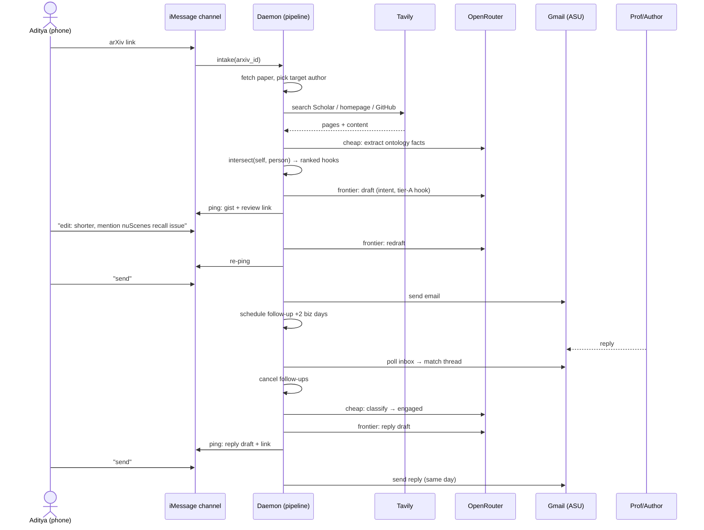
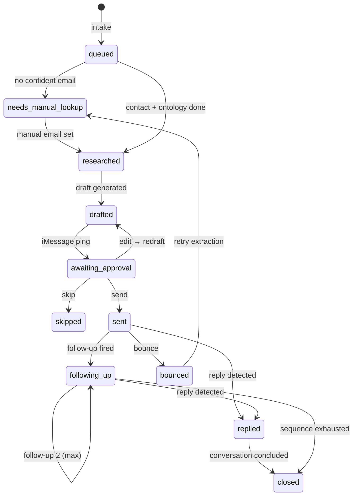

# Technical Spec: Academic Networking Email Assistant

> PRD: [`docs/prd-networking-email-assistant.md`](./prd-networking-email-assistant.md)

## Overview

A TypeScript/Node daemon running on Aditya's Mac that turns an arXiv paper into an approved, sent, and followed-up outreach email. Pipeline: intake (arXiv API) → contact extraction (tiered) → person research (Tavily) → ontology + intersection engine → draft generation (OpenRouter, hybrid model tiering) → iMessage approval (`send` / `skip` / `edit:`) → Gmail send from `apgupta3@asu.edu` → follow-up scheduling (2 business days × 2 max) → reply detection, classification, and same-day reply drafts. Every outbound message is human-approved. All state lives in a local SQLite ledger.

New subproject at `outreach/` — greenfield; touches nothing else in the workspace.

## Architecture

### Stack
| Concern | Choice | Notes |
|---|---|---|
| Runtime | Node 20+, TypeScript | |
| DB | `better-sqlite3` | Single file `outreach/data/outreach.db`; synchronous API is fine at this volume |
| Review server | Hono, server-rendered HTML | Binds `127.0.0.1:7777`; Tailscale exposes it off-network (open question) |
| LLM | OpenRouter via `openai` SDK (`baseURL` override) | Hybrid tiering — see below |
| Web search | `@tavily/core` | Free tier 1,000 credits/mo; returns extracted page content |
| arXiv | Public Atom API (`export.arxiv.org/api/query`) + `fast-xml-parser` | The arxiv MCP server is Claude-Code-only; not used by the app |
| PDF text | `unpdf` | Tier-1 email extraction from paper PDFs |
| iMessage | `imessage-kit` (photon-hq) | Send + read; **read requires Full Disk Access** (chat.db) |
| Gmail | `googleapis` (Gmail API OAuth) **or** `nodemailer`+`imapflow` (app password) | Spike in Step 1 decides |
| Scheduling | `croner` + DB-persisted `fire_at` rows | Survives sleep: on wake, fire anything past due |
| Daemon | `launchd` user agent (`KeepAlive`) | plist in `outreach/launchd/` |

### Model tiering (config-driven, `src/config.ts`)
| Tier | Tasks | Default model |
|---|---|---|
| `cheap` | research synthesis, ontology extraction, reply classification, summaries | `deepseek/deepseek-chat` (or `google/gemini-2.0-flash` class) |
| `frontier` | initial drafts, follow-up drafts, reply drafts, edit-redrafts | `anthropic/claude-sonnet-4.5` via OpenRouter |

Models are env-configurable (`MODEL_CHEAP`, `MODEL_FRONTIER`) — swap without code changes. Expected spend: ~$2–5/mo at a few outreaches/week.

### Module layout
```
outreach/
├── package.json / tsconfig.json / .env
├── data/outreach.db
├── launchd/com.apgupta.outreach.plist
└── src/
    ├── index.ts              # daemon entry: review server + pollers + scheduler
    ├── cli.ts                # `outreach add <arxiv-id>` | list | status | self-interview
    ├── config.ts             # env, model tiers, constants (poll intervals, follow-up rules)
    ├── db/
    │   ├── schema.sql
    │   └── db.ts             # connection, migrations, typed query helpers
    ├── llm/
    │   ├── client.ts         # OpenRouter client + tier router
    │   └── prompts/          # one file per task: research.ts, draft.ts, classify.ts, ...
    ├── pipeline/
    │   ├── intake.ts         # arXiv fetch, author-target selection (first author default)
    │   ├── contacts.ts       # tiered email extraction: PDF → Scholar/homepage → GitHub
    │   ├── research.ts       # Tavily searches → person ontology facts
    │   ├── intersect.ts      # self × person ontology → ranked, tiered intersections
    │   └── draft.ts          # roadmap-based generation, intent-flavored, tier-constrained hooks
    ├── email/
    │   ├── mailer.ts         # send/poll abstraction (Gmail API | SMTP+IMAP behind one interface)
    │   └── threads.ts        # reply detection, threading headers, classification dispatch
    ├── imessage/
    │   └── channel.ts        # outbound pings; inbound parser (send/skip/edit/status/arXiv links)
    ├── scheduler/
    │   └── followups.ts      # business-day math, fire/cancel, wake catch-up
    └── review/
        └── server.ts         # Hono routes + HTML pages
```

### Key design points
- **`email/mailer.ts` is an interface** (`send(msg)`, `pollInbox()`) with two implementations; the Step-1 spike picks which is wired in. Nothing upstream cares.
- **iMessage channel is also an interface** — if we later move to a VPS + Photon Spectrum relay, only `imessage/channel.ts` is replaced (PRD non-goal, but cheap to keep clean).
- **Approval routing**: inbound texts from 480-692-8263 only. Bare `send`/`skip` applies to the single most-recent `awaiting_approval` draft; if more than one is pending, the bot replies with a numbered list and requires `send <n>`. Any message containing an arXiv URL/ID triggers intake.
- **Every LLM output that becomes an email passes the grounding check** (≥1 recipient-work reference, ≥1 own-work reference — checked by a cheap-tier verifier call) before it's allowed to ping for approval.

## Data Model

SQLite, `db/schema.sql`. `self` ontology facts use `person_id = NULL`.

```sql
CREATE TABLE papers (
  id INTEGER PRIMARY KEY, arxiv_id TEXT UNIQUE NOT NULL,
  title TEXT, abstract TEXT, authors_json TEXT,      -- [{name, position}]
  pdf_path TEXT, added_via TEXT CHECK(added_via IN ('cli','imessage','web')),
  created_at TEXT DEFAULT (datetime('now'))
);

CREATE TABLE people (
  id INTEGER PRIMARY KEY, name TEXT NOT NULL,
  email TEXT, email_confidence REAL, email_source TEXT,   -- 'pdf'|'homepage'|'github'|'manual'
  affiliation TEXT, role TEXT,                            -- 'first_author'|'pi'|...
  scholar_url TEXT, homepage_url TEXT, github_url TEXT,
  created_at TEXT DEFAULT (datetime('now')), updated_at TEXT
);

CREATE TABLE ontology_facts (
  id INTEGER PRIMARY KEY,
  person_id INTEGER REFERENCES people(id),                -- NULL = Aditya (self)
  facet TEXT CHECK(facet IN ('academic','trajectory','interest')),
  key TEXT, value TEXT, source_url TEXT,
  confidence REAL, usability_tier TEXT CHECK(usability_tier IN ('A','B','C')),
  retrieved_at TEXT DEFAULT (datetime('now'))
);

CREATE TABLE intersections (
  id INTEGER PRIMARY KEY, person_id INTEGER NOT NULL REFERENCES people(id),
  self_fact_id INTEGER REFERENCES ontology_facts(id),
  person_fact_id INTEGER REFERENCES ontology_facts(id),
  strength REAL, tier TEXT CHECK(tier IN ('A','B','C')), rationale TEXT
);

CREATE TABLE outreach (                                    -- one campaign per person×paper
  id INTEGER PRIMARY KEY,
  person_id INTEGER NOT NULL REFERENCES people(id),
  paper_id INTEGER NOT NULL REFERENCES papers(id),
  intent TEXT CHECK(intent IN ('direction','gap_probe')),
  status TEXT DEFAULT 'queued' CHECK(status IN (
    'queued','needs_manual_lookup','researched','drafted','awaiting_approval',
    'sent','following_up','replied','closed','bounced','skipped')),
  gmail_thread_id TEXT,
  created_at TEXT DEFAULT (datetime('now')), updated_at TEXT,
  UNIQUE(person_id, paper_id)
);

CREATE TABLE drafts (
  id INTEGER PRIMARY KEY, outreach_id INTEGER NOT NULL REFERENCES outreach(id),
  kind TEXT CHECK(kind IN ('initial','followup_1','followup_2','reply')),
  version INTEGER DEFAULT 1, subject TEXT, body TEXT,
  hook_intersection_id INTEGER REFERENCES intersections(id),
  status TEXT DEFAULT 'pending' CHECK(status IN ('pending','approved','rejected','superseded')),
  created_at TEXT DEFAULT (datetime('now'))
);

CREATE TABLE messages (
  id INTEGER PRIMARY KEY, outreach_id INTEGER NOT NULL REFERENCES outreach(id),
  direction TEXT CHECK(direction IN ('out','in')),
  gmail_message_id TEXT UNIQUE, subject TEXT, body TEXT,
  classification TEXT,          -- in only: 'engaged'|'decline'|'question'|'auto_reply'|'bounce'
  sent_at TEXT
);

CREATE TABLE followup_schedule (
  id INTEGER PRIMARY KEY, outreach_id INTEGER NOT NULL REFERENCES outreach(id),
  seq INTEGER CHECK(seq IN (1,2)), fire_at TEXT NOT NULL,
  status TEXT DEFAULT 'scheduled' CHECK(status IN ('scheduled','fired','cancelled'))
);

CREATE TABLE approvals (
  id INTEGER PRIMARY KEY, draft_id INTEGER NOT NULL REFERENCES drafts(id),
  action TEXT CHECK(action IN ('send','skip','edit')),
  edit_instructions TEXT, via TEXT CHECK(via IN ('imessage','web')),
  created_at TEXT DEFAULT (datetime('now'))
);

CREATE TABLE events (                                      -- append-only audit log
  id INTEGER PRIMARY KEY, outreach_id INTEGER, type TEXT, detail_json TEXT,
  created_at TEXT DEFAULT (datetime('now'))
);
```

Ledger rules enforced in code: `UNIQUE(person_id, paper_id)` blocks double-contact per paper; a new outreach for a person with any prior non-`skipped` outreach requires explicit `--force`; same-affiliation warning when two people share `affiliation` within 14 days.

## API / Server Actions

Review server (Hono, `127.0.0.1:7777`):

| Route | Method | Purpose |
|---|---|---|
| `/review/:draftId` | GET | Review page: draft, paper summary, person profile, ranked intersections w/ tiers + rationale, thread history |
| `/review/:draftId/action` | POST | `{ action: 'send'\|'skip'\|'edit', instructions?: string }` → same handler the iMessage grammar calls |
| `/contacts` | GET | Ledger table (status, last activity, next follow-up) |
| `/contacts/:id` | GET | Person detail: ontology, intersections, full thread |
| `/intake` | POST | `{ arxivId: string, intent?: 'direction'\|'gap_probe' }` |
| `/health` | GET | Daemon status, last poll times, pending counts |

Auth: localhost binding is the v1 boundary. If exposed via Tailscale, add a static bearer token (`REVIEW_TOKEN` env) checked on POST routes.

iMessage inbound grammar (from allowed number only):
```
send | send <n>       → approve pending draft (n required if >1 pending)
skip | skip <n>       → reject
edit: <instructions>  → redraft (frontier model), supersede old version, re-ping
status                → counts by state + next scheduled follow-ups
<any arXiv link/ID>   → intake, replies with target-author confirmation prompt
```

## Implementation Plan

Each step ends with a **✅ Human Verification** gate — do not proceed until it passes.

**Step 1 — Gmail auth spike** (`src/email/` scratch scripts)
Try, in order: (a) app password at `myaccount.google.com/apppasswords` on the ASU account → test SMTP send + IMAP read via `nodemailer`/`imapflow`; (b) Gmail API OAuth with a personal GCP project (test-mode consent screen) → test send + read via `googleapis`.
✅ *Human: confirm a test email sent from `apgupta3@asu.edu` lands in your personal inbox, threads correctly, and the app can read a reply to it. Record which path won — it wires `mailer.ts` for the rest of the build.*

**Step 2 — iMessage spike** (`src/imessage/channel.ts` prototype)
Install `imessage-kit`; grant Full Disk Access to the terminal/node binary. Send a test text to 480-692-8263; poll chat.db for the reply.
✅ *Human: you received the text, replied "send", and the script printed your reply. Confirm you're comfortable with the FDA grant.*

**Step 3 — Scaffold + schema** (`package.json`, `tsconfig.json`, `src/db/`, `src/config.ts`)
Project init, schema migration runner, config loading, OpenRouter + Tavily clients with smoke tests.
✅ *Human: review `schema.sql` against the PRD ledger requirements; run `npm run smoke` and see one cheap-tier LLM call + one Tavily search succeed.*

**Step 4 — Intake pipeline** (`src/pipeline/intake.ts`, `src/cli.ts`)
`outreach add <arxiv-id>`: fetch metadata + PDF, store paper, propose target author (first-author default, PI fallback rationale printed).
✅ *Human: run on 2 papers you know well; confirm titles/authors/target choice are right.*

**Step 5 — Contact extraction** (`src/pipeline/contacts.ts`)
Tier 1 PDF emails → Tier 2 Tavily (Scholar profile, homepage) → Tier 3 GitHub. Below confidence threshold → `needs_manual_lookup`; `outreach set-email <person> <email>` for manual resolution.
✅ *Human: run on 3 papers; spot-check each found email against the person's real homepage. Verify the manual queue works on a paper with no findable email.*

**Step 6 — Ontology + self-ontology** (`src/pipeline/research.ts`, `outreach self-interview`)
Self-ontology: ingest resume + research-gap docs + interactive self-interview (places lived, hobbies, communities). Person ontology: Tavily research → cheap-tier extraction into `ontology_facts` with facet, source, confidence, usability tier.
✅ *Human: complete the self-interview (~15 min). Review one generated person ontology: are facts accurate and sourced? Are the A/B/C tiers assigned the way you'd judge them? This gate calibrates the creepiness boundary — take it seriously.*

**Step 7 — Intersection engine** (`src/pipeline/intersect.ts`)
Cross self × person facts, score strength, inherit min(usability tier), store rationale.
✅ *Human: review ranked intersections for 2 people; confirm the top Tier-A hook is one you'd genuinely open with.*

**Step 8 — Draft generation** (`src/pipeline/draft.ts`, `src/llm/prompts/draft.ts`)
Roadmap prompt (hook → intro+credibility → engagement with their work → ask → close), intent-flavored, tier-constrained hook, 120–180 words, grounding verifier gate.
✅ *Human: read 3 generated drafts cold. Bar: would you send this with ≤1 small edit? If not, iterate on the prompt before building further — this is the product.*

**Step 9 — Review server** (`src/review/server.ts`)
All routes above; plain server-rendered HTML, mobile-readable.
✅ *Human: open a review page on your phone (same network); confirm you can understand the full context and approve/reject/edit from the page.*

**Step 10 — iMessage approval loop** (`src/imessage/channel.ts` full)
Wire grammar → approval handler; pings on new pending drafts with gist + review link; help response for unrecognized input.
✅ *Human: full flow on a test draft — get the ping, open the link, reply `edit: shorter`, get re-ping, reply `send` (wired to a dry-run sender for now).*

**Step 11 — Send + ledger integration** (`src/email/mailer.ts`, `threads.ts` outbound)
Approved draft → real send → store `gmail_thread_id`/`message_id` → status `sent` → schedule follow-up #1 (+2 business days). Double-contact and same-lab guards active.
✅ *Human: approve a send to your own personal address; confirm it arrives, threads in the ASU Sent folder, ledger shows `sent` with a follow-up scheduled at the correct business-day timestamp.*

**Step 12 — Reply handling** (`src/email/threads.ts` inbound)
Inbox poll → match to tracked threads → cancel follow-ups → classify → (non-auto-reply) frontier reply draft → approval loop. Bounce → mark email bad, back to extraction.
✅ *Human: reply from your personal address; confirm follow-ups cancel, classification is `engaged`, and a contextual reply draft pings you same-session. Also send an OOO-style auto-reply and confirm it does NOT cancel follow-ups or draft a response.*

**Step 13 — Follow-up scheduler** (`src/scheduler/followups.ts`)
Business-day math, fire-time re-check of reply status, max-2 cap, wake catch-up (fire past-due on daemon start).
✅ *Human: with a compressed test config (minutes instead of days), watch follow-up #1 draft + ping, approve, then reply mid-sequence and confirm #2 cancels. Kill the daemon over a fire time, restart, confirm catch-up.*

**Step 14 — Daemonize + end-to-end dry run** (`launchd/`, `src/index.ts`)
launchd plist (KeepAlive, logs to `data/logs/`), `outreach doctor` health check.
✅ *Human: reboot the Mac; confirm the daemon comes back and `/health` is green. Run one real paper end-to-end up to the approval ping. Final go/no-go: approve your first real outreach email.*

## Mermaid Diagrams

### Happy-path sequence


### Outreach state machine


## Open Questions

1. **Gmail path** — resolved by Step 1 spike. If ASU blocks *both* app passwords and personal-GCP OAuth, escalate: options are ASU IT request, or personal-Gmail fallback (loses `.edu` signal — decision point with user).
2. **Off-network review links** — recommend Tailscale (free, zero config beyond install); decide at Step 9. Fallback: full draft body in the iMessage when off-network.
3. **chat.db read stability** — imessage-kit depends on macOS not changing chat.db schema; Step 2 spike validates on current macOS. If flaky: fallback to approval-via-review-page only.
4. **Exact model picks** — defaults above; revisit after Step 8 quality gate. Config-only change.
5. **Tavily budget** — 1,000 credits/mo ≈ 50–100 people researched; no action unless volume 10×es. Monitor via `events` log.
6. **v2 parking lot** (from PRD): standing arXiv watch, conference-deadline timing, VPS + Photon Spectrum relay, "I extended your work" intent.
```
