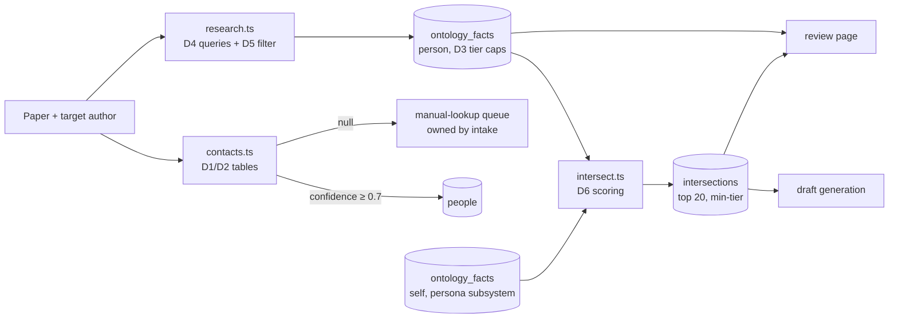

# Technical Spec: Profile Mining

> PRD: [`docs/prd-profile-mining.md`](./prd-profile-mining.md)

## Overview

TypeScript modules inside the `outreach/` project that take a target person (name plus paper context) and produce: a confident contact email (or a not-found result), a structured person ontology in SQLite, and ranked, tiered intersections against the self-ontology. Pipeline: contact extraction (PDF → Scholar/homepage → GitHub) → Tavily research → cheap-tier LLM fact extraction → intersection scoring. Consumed downstream by draft generation and the review page; consumes the self-ontology produced by the persona subsystem.

## Architecture

### Stack (subsystem-relevant slice)
| Concern | Choice | Notes |
|---|---|---|
| Web search | `@tavily/core` | Free tier 1,000 credits/mo; returns extracted page content |
| PDF text | `unpdf` | Tier-1 email extraction from paper PDFs |
| LLM | OpenRouter, `cheap` tier (`MODEL_CHEAP`, default `deepseek/deepseek-chat` class), temperature 0 | Fact extraction, profile summarization, intersection scoring |
| DB | shared `better-sqlite3` ledger (`outreach/data/outreach.db`) | Tables below |

### Modules
```
outreach/src/pipeline/
├── contacts.ts     # tiered email extraction: PDF → Scholar/homepage → GitHub
├── research.ts     # Tavily searches → person ontology facts
└── intersect.ts    # self × person ontology → ranked, tiered intersections
```

## Resolved Decisions (ambiguity killers)

### D1. Email confidence table
Confidence is assigned from this table, not by the LLM. Threshold: **≥ 0.7 send-eligible**; below goes to the manual-lookup queue.

| Source | Condition | Confidence |
|---|---|---|
| Paper PDF | corresponding-author marker AND name match | 0.95 |
| Paper PDF | name match, no marker | 0.85 |
| University/lab homepage | mailto or plaintext on the person's own page | 0.85 |
| University/lab directory listing | name match | 0.75 |
| GitHub profile public email | name match | 0.70 |
| GitHub commit metadata | name match, not `noreply` | 0.55 |
| Any source | no name match | 0.0 (discarded) |

If multiple emails qualify, highest confidence wins; ties broken by preferring `.edu` domains.

**Paper-email age decay.** A paper email reflects the author's institution *at publication time*, which goes stale as people move (a 2023 paper's `.fr` address may now bounce). The paper-PDF confidences above apply only when the paper is < 12 months old. Older papers decay the PDF confidence by 0.15 per full year beyond the first, floored at 0.5:
`confidence = base - 0.15 * max(0, floor(ageMonths / 12) - 1)`, floor 0.5.
So a corresponding-author email (base 0.95) is 0.95 at < 24 months, 0.80 at 2 to 3 years, 0.65 at 3 to 4 years. This does not discard the paper email; it lets a fresh web-sourced email outrank a stale one.

### D1a. Extraction orchestration and reconciliation
Tier 1 (PDF) no longer unconditionally short-circuits.
- If the paper is < 12 months old AND tier 1 yields an email at confidence ≥ 0.7, return it without web search (fast path, no staleness risk).
- Otherwise always run the web tier (tier 2/3) as well, then reconcile: pick the highest-confidence candidate across *both* sources using the (decayed) D1 scores; `.edu` tie-break as before.
- When a web email and a paper email disagree and both are ≥ 0.7, both are recorded; the winner is used and the review page shows the alternate ("paper listed X; current web sources list Y"). Freshness beats the paper on ties.
- Current affiliation discovered by Step B (person research) is fed back as the affiliation hint for the web queries, so the search targets where the person *is now*, not where the paper says they were.

### D1b. Web page fetch (tier 2/3 is fetch-based, not snippet-based)
Search returns ranked result pages; emails rarely appear in the search *snippet*. So:
- Classify results (D-classify below); rank personal/lab homepages and official directory pages above aggregators. Aggregator hosts (`rocketreach.co`, `researchgate.net`, `academia.edu`, `scholar.google.com`, `dl.acm.org`, `kitcaster.com`, and similar) are never treated as homepages and are deprioritized.
- Fetch full page content (Tavily `extract`) for up to the top 3 non-aggregator candidate pages, then scan that content for emails (with `[at]`/`[dot]` deobfuscation).
- Budget: at most 3 extract calls per person on top of the search queries. If none of the top 3 pages yields a name-matching email, tier 2/3 returns nothing (→ manual queue), exactly as before.

### D2. Name-match rule
An email local part matches a person if, after lowercasing and stripping digits/punctuation, it contains (a) the full last name, or (b) the full first name, or (c) an initials pattern (first initial + last name, or first name + last initial). Example: for "Aditya Gupta", `agupta`, `aditya.g`, `gupta3` match; `avsim.lab` does not.

### D3. Tier-cap table (source class → maximum usability tier)
The extractor proposes a tier; code clamps it to the cap. A Tier-C source can never yield an A or B fact.

| Source class | Cap |
|---|---|
| arXiv, DBLP, Google Scholar | A |
| University or lab page, official directory | A |
| GitHub repos, profile README, contribution history | A |
| Conference program/workshop pages | A |
| Person's own blog posts | B |
| Personal-homepage bio/about sections (non-research content) | B |
| Conference bios, podcast/talk appearances | B |
| X/social posts, archived/old profiles, forums, personal social media | C |
| Anything else | C |

### D4. Research query plan (max 6 Tavily queries per person)
1. `"<name>" <affiliation>`
2. `"<name>" Google Scholar`
3. `"<name>" <affiliation> homepage`
4. `"<name>" GitHub`
5. `"<name>" blog OR talk OR podcast`
6. One free follow-up query, chosen by the extractor only if a specific lead needs confirmation (e.g. a homepage URL found in query 1).

Fact extraction batches all accepted pages into at most 3 cheap-tier LLM calls; one more call produces the short profile summary. Total per person: ≤ 6 searches, ≤ 4 LLM calls.

### D5. Identity corroboration signals
A page contributes facts only if at least one holds:
- Affiliation on the page matches the paper's affiliation hint.
- A co-author's name from the paper appears on the page.
- The paper title or arXiv ID appears on the page.
- The page's research area overlaps the paper's primary arXiv category (LLM judgment, but only as a last resort when 1 to 3 fail).
- The page is directly linked from an already-accepted page (e.g. Scholar profile links the homepage).

### D6. Intersection scoring rubric
Cheap-tier LLM scores each candidate pair 0 to 1 with this rubric in the prompt:
- 0.9 to 1.0: same specific research problem, method, or artifact (e.g. both worked with nuScenes evaluation, both built 3DGS pipelines).
- 0.7 to 0.8: same subfield plus a concrete shared element (venue, dataset, open-source ecosystem, institution).
- 0.5 to 0.6: same broad field, or a specific non-academic overlap (same city lived in, same community).
- 0.3 to 0.4: generic overlap (both do ML, both like hiking).
- Below 0.3: discarded, not stored.

Storage cap: top 20 per person, ranked by strength descending. `tier = min(self_fact.tier, person_fact.tier)`. Facts with confidence < 0.5 never enter scoring. If nothing scores ≥ 0.5, `computeIntersections` returns `{ noStrongHook: true }` alongside whatever weak intersections exist.

### D7. Staleness
Facts with `retrieved_at` older than **180 days** are re-verified before backing a hook: one targeted Tavily query re-checks the fact; confirmed → `retrieved_at` refreshed; contradicted → confidence dropped to 0.4 (excluded from hooks) and the fresh fact inserted. Re-verification is lazy (only for facts backing the top-ranked intersections handed to the drafter).

### D8. Conflict rule
Two facts with the same `(person, facet, key)` but different values: the one from the more recent primary source keeps its confidence; the other is set to 0.4. Primary-source order: person's own homepage > Scholar > university page > everything else.

### D9. Self-ontology dependency
`intersect.ts` reads `ontology_facts WHERE person_id IS NULL`, read-only. If zero self facts exist it throws `SelfOntologyMissingError` with the message "Run persona setup first." For development and tests before the persona subsystem exists, a fixture file (`test/fixtures/self-ontology.json`) is loaded by test setup and by an interim dev command `outreach dev:seed-self <file>`; that command is deleted when the persona subsystem lands.

### D10. Where "manual-lookup queue" lives
Contact extraction itself is stateless: it returns a result or `null`. The caller (intake pipeline) sets the owning outreach record to `needs_manual_lookup`. The queue is just a query over that status, surfaced by `outreach list --needs-email` and the review page. This subsystem does not own outreach-status transitions.

## Data Model

Owned tables (shared `db/schema.sql`):

```sql
CREATE TABLE people (
  id INTEGER PRIMARY KEY, name TEXT NOT NULL,
  email TEXT, email_confidence REAL, email_source TEXT,   -- 'pdf'|'homepage'|'github'|'manual'
  affiliation TEXT, role TEXT,                            -- 'first_author'|'pi'|...
  scholar_url TEXT, homepage_url TEXT, github_url TEXT,
  created_at TEXT DEFAULT (datetime('now')), updated_at TEXT
);

CREATE TABLE ontology_facts (
  id INTEGER PRIMARY KEY,
  person_id INTEGER REFERENCES people(id),                -- NULL = Aditya (self; written by persona subsystem)
  facet TEXT CHECK(facet IN ('academic','trajectory','interest')),
  key TEXT, value TEXT, source_url TEXT,
  confidence REAL, usability_tier TEXT CHECK(usability_tier IN ('A','B','C')),
  retrieved_at TEXT DEFAULT (datetime('now'))
);

CREATE TABLE intersections (
  id INTEGER PRIMARY KEY, person_id INTEGER NOT NULL REFERENCES people(id),
  self_fact_id INTEGER REFERENCES ontology_facts(id),
  person_fact_id INTEGER REFERENCES ontology_facts(id),
  strength REAL, tier TEXT CHECK(tier IN ('A','B','C')), rationale TEXT
);
```

`ontology_facts.key` is freeform but drawn from a recommended vocabulary per facet (kept as a constant in code): academic → `research_area`, `method`, `dataset`, `key_paper`, `venue`, `advisor`, `lab`; trajectory → `institution`, `company`, `role`, `location`; interest → `hobby`, `side_project`, `oss_project`, `community`, `writing`.

## Interfaces

| Interface | Shape | Consumer |
|---|---|---|
| `extractContact(person, paperPdfPath, paperContext)` | `{email, confidence, source} \| null` | intake pipeline |
| `minePerson(personId, paperContext)` | writes `ontology_facts`; returns `{profileSummary, factCount, thin: boolean}` | intake pipeline |
| `computeIntersections(personId)` | writes `intersections`; returns `{ranked: Intersection[], noStrongHook: boolean}` | draft generation |
| `/contacts/:id` data | ontology + intersections + sources | review page |

`paperContext` shape (built by intake): `{ arxivId, title, abstract, primaryCategory, coauthors: string[], affiliationHint: string | null }`.

## Implementation Plan

Steps map to the master plan (spec-networking-email-assistant Steps 5 to 7); each ends with a ✅ human gate.

**Step A — Contact extraction** (`contacts.ts`)
Tier 1 PDF emails → Tier 2 Tavily (Scholar profile, homepage) → Tier 3 GitHub, using D1/D2 tables. Below threshold → return `null`.
✅ *Human: run on 3 papers; spot-check each found email against the person's real homepage. Verify a paper with no findable email returns null and surfaces in the queue.*

**Step B — Person ontology** (`research.ts`)
D4 query plan → D5 corroboration filter → cheap-tier extraction into `ontology_facts` with facet, source, confidence, D3 tier caps.
✅ *Human: review one generated person ontology: are facts accurate and sourced? Are the A/B/C tiers assigned the way you'd judge them? This gate calibrates the creepiness boundary (and the D1/D3 tables), take it seriously.*

**Step C — Intersection engine** (`intersect.ts`)
D6 scoring over self × person facts, min-tier inheritance, D7 staleness check, rationale storage. Self-ontology from fixture (D9) until persona subsystem exists.
✅ *Human: review ranked intersections for 2 people; confirm the top Tier-A hook is one you'd genuinely open with, and that a thin-footprint person yields an honest `noStrongHook`.*

## Mermaid Diagram



## Open Questions

None blocking. The D1/D3 tables are first drafts by design; the Step B human gate calibrates them. Tavily budget is monitored via the events log.
