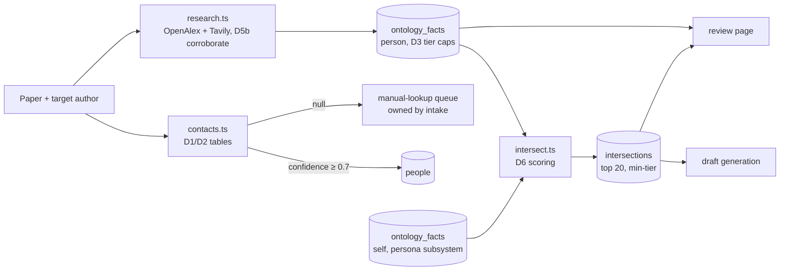

# Technical Spec: Profile Mining

> PRD: [`docs/prd-profile-mining.md`](./prd-profile-mining.md)

## Overview

TypeScript modules inside the `outreach/` project that take a target person (name plus paper context) and produce: a confident contact email (or a not-found result), a structured person ontology in SQLite, and ranked, tiered intersections against the self-ontology. Pipeline: contact extraction (PDF → homepage/directory/GitHub via Tavily) → research (OpenAlex for academic facts + identity, Tavily for personal free-text facets) → cheap-tier LLM fact extraction → intersection generation. Consumed downstream by draft generation and the review page; consumes the self-ontology produced by the persona subsystem.

## Architecture

### Stack (subsystem-relevant slice)
| Concern | Choice | Notes |
|---|---|---|
| Web search | `@tavily/core` | Free tier 1,000 credits/mo; snippets + full-page `extract` |
| Academic data | OpenAlex REST (`fetch`, no SDK, no key) | Author identity, co-authors, time-stamped affiliations, concepts, works; polite `User-Agent` |
| PDF text | `unpdf` | Tier-1 email extraction from paper PDFs |
| Registrable domain | `tldts` | Public-suffix-aware domain reduction (D-domain) |
| LLM | OpenRouter, `cheap` tier (`MODEL_CHEAP`, default `deepseek/deepseek-chat` class), temperature 0 | Fact extraction, profile summarization, intersection scoring |
| DB | shared `better-sqlite3` ledger (`outreach/data/outreach.db`) | Tables below |

### Modules
```
outreach/src/pipeline/
├── contacts.ts     # tiered email extraction: PDF → homepage/directory/GitHub (Tavily)
├── research.ts     # OpenAlex (academic/identity) + Tavily (personal) → ontology facts
└── intersect.ts    # self × person ontology → ranked, tiered intersections
```

## Resolved Decisions (ambiguity killers)

### D1. Email confidence table
Confidence is assigned from this table, not by the LLM. Threshold: **≥ 0.7 send-eligible**; below goes to the manual-lookup queue.

| Source | Condition | Confidence |
|---|---|---|
| Paper PDF | corresponding-author marker AND name match | 0.95 |
| Paper PDF | name match, no marker | 0.85 |
| University/lab homepage | mailto or plaintext on the person's own page | 0.85 |
| University/lab directory listing | name match | 0.75 |
| GitHub profile public email | name match | 0.70 |
| GitHub commit metadata | name match, not `noreply` | 0.55 |
| Any source | no name match | 0.0 (discarded) |

If multiple emails qualify, highest confidence wins; ties broken by preferring `.edu` domains.

**Paper-email age decay.** A paper email reflects the author's institution *at publication time*, which goes stale as people move (a 2023 paper's `.fr` address may now bounce). The paper-PDF confidences above apply only when the paper is < 12 months old. Older papers decay the PDF confidence by 0.15 per full year beyond the first, floored at 0.5:
`confidence = base - 0.15 * max(0, floor(ageMonths / 12) - 1)`, floor 0.5.
So a corresponding-author email (base 0.95) is 0.95 at < 24 months, 0.80 at 2 to 3 years, 0.65 at 3 to 4 years. This does not discard the paper email; it lets a fresh web-sourced email outrank a stale one.

### D1a. Extraction orchestration and reconciliation
Tier 1 (PDF) no longer unconditionally short-circuits.
- If the paper is < 12 months old AND tier 1 yields an email at confidence ≥ 0.7, return it without web search (fast path, no staleness risk).
- Otherwise always run the web tier (tier 2/3) as well, then reconcile: pick the highest-confidence candidate across *both* sources using the (decayed) D1 scores; `.edu` tie-break as before.
- When a web email and a paper email disagree and both are ≥ 0.7, both are recorded; the winner is used and the review page shows the alternate ("paper listed X; current web sources list Y"). Freshness beats the paper on ties.
- Current affiliation is discovered automatically inside contact extraction (D1c), not supplied by a human or a separate step, so the search targets where the person *is now*, not where the paper says they were.

### D1c. Automated affiliation-discovery second pass
The web tier runs in up to two passes so a mover's *current* email is found with zero human input. Empirically, the person's current homepage surfaces on a plain name search even when the paper's affiliation is stale; the homepage's own domain then names the current institution, and a domain-scoped re-query surfaces the current email.
- **Pass 1** (D1b): queries `"<name>" <paperAffiliation?> email` and `"<name>" github`. Fetch + scan top-3 non-aggregator pages plus snippets. `paperAffiliation` is whatever the paper gave (may be empty or stale); it is a hint, never required.
- **Trigger**: run Pass 2 only if Pass 1 yields no candidate at confidence ≥ 0.7. (A confident Pass-1 hit means we already have the current email.)
- **Domain derivation** (D-domain): from each non-aggregator homepage/directory result in Pass 1, compute the *registrable domain* (public-suffix aware: `cg.tuwien.ac.at` → `tuwien.ac.at`, `di.ku.dk` → `ku.dk`). Collect unique registrable domains, drop aggregator and generic-host domains (gmail.com, github.io, etc.), keep the **top 2** by Pass-1 rank.
- **Pass 2**: for each kept domain, query `"<name>" <domain>`. Fetch + scan top non-aggregator results (shared fetch budget, see below).
- **Reconciliation**: all candidates from the paper, Pass 1, and Pass 2 go through `selectEmail` with age decay (D1a). Multiple current affiliations need no "which is current" logic: name-match + confidence pick the winner, alternates are recorded.
- **Termination & budget**: exactly one Pass 2, no recursion. Hard caps per person: ≤ 4 searches (2 + 2) and ≤ 2 fetch batches of ≤ 3 pages each (≤ 6 extract calls), within the PRD's ≤ 6-search / cost budget.

**D-domain (registrable-domain rule).** Use a public-suffix list (bundled, offline) to reduce a hostname to registrable domain + suffix. Hosts on the aggregator list (D1b) and generic personal/hosting domains (`gmail.com`, `outlook.com`, `github.io`, `googleusercontent.com`, and similar) are excluded from the current-institution domain set: they are not institutional signals.

### D1b. Web page fetch (tier 2/3 is fetch-based, not snippet-based)
Search returns ranked result pages; emails rarely appear in the search *snippet*. So:
- Classify results (D-classify below); rank personal/lab homepages and official directory pages above aggregators. Aggregator hosts (`rocketreach.co`, `researchgate.net`, `academia.edu`, `scholar.google.com`, `dl.acm.org`, `kitcaster.com`, and similar) are never treated as homepages and are deprioritized.
- Fetch full page content (Tavily `extract`) for up to the top 3 non-aggregator candidate pages, then scan that content for emails (with `[at]`/`[dot]` deobfuscation).
- Budget: at most 3 extract calls per person on top of the search queries. If none of the top 3 pages yields a name-matching email, tier 2/3 returns nothing (→ manual queue), exactly as before.

### D2. Name-match rule
An email local part matches a person if, after lowercasing and stripping digits/punctuation, it contains (a) the full last name, or (b) the full first name, or (c) an initials pattern (first initial + last name, or first name + last initial). Example: for "Aditya Gupta", `agupta`, `aditya.g`, `gupta3` match; `avsim.lab` does not.

### D3. Tier-cap table (source class → maximum usability tier)
The extractor proposes a tier; code clamps it to the cap. A Tier-C source can never yield an A or B fact. **Source class is assigned deterministically**, not by the LLM: OpenAlex → `openalex`; a fetched web page → its `classifyWebPage` result (`homepage`/`directory`/`github_profile`/`aggregator`) refined by URL path (a `/blog/` or `/posts/` path under a homepage → `blog`; a known social host → `social`).

| Source class (detectable) | Cap | Notes |
|---|---|---|
| `openalex` | A | structured academic/institutional data |
| `homepage` (research/about), `directory`, `github_profile` | A | institutional / professional |
| `blog` (own blog posts), homepage bio/personal sections | B | professional-adjacent personal |
| conference bios, podcast/talk pages | B | |
| `social`, archived/old profiles, forums | C | dig-only; never referenced in an email |
| anything else / `aggregator` | C | aggregators contribute no facts anyway |

### D3a. External data sources (OpenAlex + Tavily) — grounds D4/D5b/D6a
Validated with live OpenAlex calls (Kerbl):
- **OpenAlex** (`api.openalex.org`, free, no key, polite `User-Agent` carrying `apgupta3@asu.edu`) is the backbone for academic + institutional facts and identity. One author-search + author-detail + recent-works query yields: disambiguated author identity, **co-author full names per work**, **time-stamped affiliations** (so current affiliation = the most recent affiliation year: Kerbl resolves to TU Wien 2020–2025 over INRIA 2023–2024), research **concepts**, and work **titles/venues/years**. This replaces Google Scholar (scraping is blocked; Tavily returns only thin Scholar snippets).
- **Tavily** is used only for the free-text facets OpenAlex lacks: personal-homepage bio, blog posts, GitHub activity, talks/podcasts (the `interest` facet and B/C-tier personal facts).
- No Scholar / LinkedIn scraping (PRD non-goal).
- Bonus coupling: OpenAlex's current affiliation can be fed back to contact extraction (Step A) to sharpen a mover's email search, replacing the stale paper affiliation.

### D4. Research plan and budget (per person)
- **OpenAlex (≤ 3 HTTP calls)**: (1) `/authors?search=<name>`; (2) resolve to the paper's author via D5b; (3) `/works?filter=author.id:<id>&sort=publication_date:desc&per_page=25` for co-authors, venues, current affiliation, concepts.
- **Tavily (≤ 3 searches, ≤ 3 fetches)**: `"<name>" <currentAffiliation> homepage`, `"<name>" blog OR talk`, `"<name>" github` — using the **current** affiliation from OpenAlex, not the stale paper one.
- **LLM (cheap tier, ≤ 4 calls)**: extract facts from the fetched Tavily free-text pages (OpenAlex data is structured and needs no LLM) in ≤ 3 calls; 1 call for the short profile summary.
- Hard caps: ≤ 3 OpenAlex calls, ≤ 3 Tavily searches, ≤ 3 fetches, ≤ 4 cheap LLM calls per person.

### D5. Identity corroboration (split: retrieval-time now, semantic in Step B)
Common names are the core risk: a plain `"Jonathan Barron"` search returns a lawyer, a med student, and an honors undergrad before the researcher, whose homepage is not even in the top 8. Two empirical facts drive the split:
1. Paper affiliation in the *query* fixes retrieval: `"Jonathan Barron" Google` surfaces the right person and email. The paper always carries an affiliation, so this context is always available.
2. Co-author / paper-title corroboration is **not** present in search snippets (a name-only search yields no co-author full names; only short-token false positives like "Ng"). Reliable co-author/title corroboration therefore requires *fetching and reading* Scholar/DBLP pages, i.e. the Step B research layer.

**D5a — retrieval-time disambiguation (contact extraction, deterministic, now).**
- Contact extraction takes a `PaperContext` (`affiliationHint`, `coauthors`, `title`, `arxivId`, `areaTerms`). Intake always supplies `affiliationHint` (every paper lists the author's affiliation).
- Pass-1 queries are enriched with **`affiliationHint` only**. This was validated empirically: affiliation disambiguates common names (`"Jonathan Barron" Google` finds the researcher, not the lawyer) *and* still surfaces a mover's current homepage (`"Bernhard Kerbl" INRIA` still returns his current `cg.tuwien.ac.at` page). **Area terms are deliberately NOT put in the query**: topic keywords like "gaussian splatting" over-anchor to the paper and push the mover's *current* page out of the results, breaking D1c domain discovery. `areaTerms`/`coauthors`/`title`/`arxivId` are carried on `PaperContext` but reserved for D5b.
- The two-pass domain discovery (D1c) handles movers: the affiliation-enriched (or, when affiliation is absent, plain-name) pass-1 search surfaces the current homepage, whose domain then drives pass 2.
- **Conservative guard**: if no `affiliationHint` is available, web-sourced emails are not send-eligible (they route to the manual queue), because without an affiliation a common name cannot be safely disambiguated. In the real pipeline this rarely fires (intake always provides affiliation); it exists so a context-free call can never confidently pick a homonym.

**D5b — identity corroboration via OpenAlex (Step B, deterministic-first).** Resolve the paper's author to a single OpenAlex author; that author's record then *is* the corroborated footprint. Validated live: for a NeRF paper, "Jonathan T. Barron" matches all four paper co-authors while the finance and poetry homonyms match none.
- **Name prefilter**: `/authors?search=<name>` is fuzzy and also returns frequent *collaborators* (e.g. searching "Jonathan Barron" surfaces Ben Poole, Kyle Genova). Keep only candidates whose `display_name` satisfies the D2 name-match (surname + first name/initial) before scoring.
- Score each surviving candidate against `PaperContext`: **strong** signal if one of the candidate's works has a co-author whose full name matches a paper co-author (last name ≥ 4 chars, avoiding the "Ng" trap), or a work title matches the paper title, or the arXiv ID / DOI matches; **weak** signal if a candidate research concept overlaps the paper's primary area and a listed affiliation matches `affiliationHint`.
- Accept the top candidate if it has ≥ 1 strong signal or ≥ 2 weak signals; otherwise the person is **UNRESOLVED** → skip academic facts and flag the person "identity unconfirmed" for the drafter. LLM area-overlap is only a last-resort tie-break between two otherwise-equal candidates.
- A Tavily free-text page contributes facts only if its domain matches the resolved author's current/known affiliation domain or homepage, or it is linked from an OpenAlex-listed URL. This is what stops a same-named homonym's homepage from injecting facts.

### D6a. Fact schema, confidence, and extraction
Every `ontology_facts` row: `{ facet, key, value, source_url, confidence 0-1, usability_tier }`.
- **OpenAlex facts (no LLM, deterministic confidence)**: current affiliation 0.9, prior affiliations 0.8, research concepts 0.85, venues 0.8, co-authors→advisor/lab inference 0.7. Facet `academic` or `trajectory`; tier A (source class `openalex`).
- **Tavily free-text facts (cheap LLM)**: the extractor returns a JSON array of `{ facet, key, value, confidence, proposedTier }`; code clamps `proposedTier` to the page's D3 source-class cap. Confidence rubric in the prompt: 0.8 explicit first-person statement on the person's own page; 0.6 stated on a corroborated third-party page; < 0.5 inferred/uncertain (stored but excluded from intersections). Temperature 0, JSON mode; on parse failure retry once, then skip that page (never crash the run).
- `key` is drawn from the D-vocabulary constant (below the schema). Facts below confidence 0.5 are excluded from intersections (D6) and from hooks.

### D6. Intersection generation (bounded LLM, not pairwise)
Do **not** score all self×person pairs (O(n·m) calls). A single cheap-tier LLM call receives the full self-fact list and the full person-fact list (both pre-filtered to confidence ≥ 0.5), each fact prefixed with a **stable index** (`s0, s1, ...` for self, `p0, p1, ...` for person, since `key` is not unique), and returns candidate intersections as JSON `{ self: "s2", person: "p5", strength, rationale }`. A second chunked call runs only if either list > 40 facts. Code maps indices back to fact ids, sets `tier = min(self_fact.tier, person_fact.tier)`, drops strength < 0.3 or any index out of range, keeps the top 20 by strength. Intersections are derived data, so the store **replaces** a person's intersections on each recompute (unlike facts, which accumulate).

Strength rubric (in the prompt):
- 0.9 to 1.0: same specific research problem, method, or artifact (e.g. both worked with nuScenes evaluation, both built 3DGS pipelines).
- 0.7 to 0.8: same subfield plus a concrete shared element (venue, dataset, open-source ecosystem, institution).
- 0.5 to 0.6: same broad field, or a specific non-academic overlap (same city lived in, same community).
- 0.3 to 0.4: generic overlap (both do ML, both like hiking).
- Below 0.3: discarded, not stored.

If nothing scores ≥ 0.5, `computeIntersections` returns `{ noStrongHook: true }` alongside whatever weak intersections exist.

### D7. Staleness
Facts with `retrieved_at` older than **180 days** are re-verified before backing a hook: one targeted Tavily query re-checks the fact; confirmed → `retrieved_at` refreshed; contradicted → confidence dropped to 0.4 (excluded from hooks) and the fresh fact inserted. Re-verification is lazy (only for facts backing the top-ranked intersections handed to the drafter).

### D8. Conflict rule
Two facts with the same `(person, facet, key)` but different values: the one from the more recent primary source keeps its confidence; the other is set to 0.4. Primary-source order: OpenAlex (structured) > person's own homepage > university page > everything else.

### D9. Self-ontology dependency
`intersect.ts` reads `ontology_facts WHERE person_id IS NULL`, read-only. If zero self facts exist it throws `SelfOntologyMissingError` with the message "Run persona setup first." For development and tests before the persona subsystem exists, a fixture file (`test/fixtures/self-ontology.json`) is loaded by test setup and by an interim dev command `outreach dev:seed-self <file>`; that command is deleted when the persona subsystem lands.

### D10. Where "manual-lookup queue" lives
Contact extraction itself is stateless: it returns a result or `null`. The caller (intake pipeline) sets the owning outreach record to `needs_manual_lookup`. The queue is just a query over that status, surfaced by `outreach list --needs-email` and the review page. This subsystem does not own outreach-status transitions.

## Data Model

Owned tables (shared `db/schema.sql`):

```sql
CREATE TABLE people (
  id INTEGER PRIMARY KEY, name TEXT NOT NULL,
  openalex_id TEXT UNIQUE,                                -- stable dedup key (D11); NULL until resolved
  email TEXT, email_confidence REAL, email_source TEXT,   -- 'pdf'|'homepage'|'github'|'manual'
  affiliation TEXT, role TEXT,                            -- 'first_author'|'pi'|...
  scholar_url TEXT, homepage_url TEXT, github_url TEXT,
  profile_summary TEXT,                                   -- from minePerson (D11)
  created_at TEXT DEFAULT (datetime('now')), updated_at TEXT
);

CREATE TABLE ontology_facts (
  id INTEGER PRIMARY KEY,
  person_id INTEGER REFERENCES people(id),                -- NULL = Aditya (self; written by persona subsystem)
  facet TEXT CHECK(facet IN ('academic','trajectory','interest')),
  key TEXT, value TEXT, source_url TEXT,
  confidence REAL, usability_tier TEXT CHECK(usability_tier IN ('A','B','C')),
  retrieved_at TEXT DEFAULT (datetime('now'))
);

CREATE TABLE intersections (
  id INTEGER PRIMARY KEY, person_id INTEGER NOT NULL REFERENCES people(id),
  self_fact_id INTEGER REFERENCES ontology_facts(id),
  person_fact_id INTEGER REFERENCES ontology_facts(id),
  strength REAL, tier TEXT CHECK(tier IN ('A','B','C')), rationale TEXT
);
```

`ontology_facts.key` is freeform but drawn from a recommended vocabulary per facet (kept as a constant in code): academic → `research_area`, `method`, `dataset`, `key_paper`, `venue`, `advisor`, `lab`; trajectory → `institution`, `company`, `role`, `location`; interest → `hobby`, `side_project`, `oss_project`, `community`, `writing`.

### D11. Persistence
- **Stack**: `better-sqlite3`, one file `outreach/data/outreach.db` (gitignored). `db/schema.sql` holds the tables; `db/db.ts` opens the connection and runs the schema idempotently (`CREATE TABLE IF NOT EXISTS`) on first open. Foreign keys on; WAL mode.
- **Person upsert (dedup)**: keyed by `openalex_id` when the author is resolved (the common path), else inserted by name. `upsertPerson(fields)` returns the row id; an existing `openalex_id` updates the row (name/affiliation/urls/email/profile_summary) rather than duplicating. This is what makes "mine once, reuse" real.
- **Fact write strategy (accumulate)**: facts accumulate across mines rather than being replaced. `ontology_facts` has `UNIQUE(person_id, facet, key, value)`; `saveFacts(personId, facts)` upserts each fact (`ON CONFLICT` refreshes `retrieved_at`, `confidence`, `source_url`, `usability_tier`) inside a transaction. A fact seen again has its `retrieved_at` bumped (feeding D7 staleness); a genuinely new fact is inserted; a fact not seen this run is **kept** with its old `retrieved_at` (so history and prior-institution facts survive, and D7 can age or re-verify them). The D8 cross-source conflict rule still runs *within* a mine in `research.ts`; the store just never discards.
- **Self-ontology** (`person_id IS NULL`) is written by the persona subsystem; the store supports it but this subsystem never writes self facts. The interim `dev:seed-self` command (D9) loads a fixture for testing until then.
- **In-memory → row mapping**: `OntologyFact { facet, key, value, sourceUrl, confidence, tier }` maps to `ontology_facts { facet, key, value, source_url, confidence, usability_tier }`; `retrieved_at` defaults to now.
- The store is a thin data layer: it does not call OpenAlex/Tavily/LLM. `minePerson` stays pure (returns facts); a separate `persistPerson(db, resolution, raw, mineResult)` wires mining output into the store, keeping persistence and mining independently testable.

## Interfaces

| Interface | Shape | Consumer |
|---|---|---|
| `extractContact(person, paperPdfPath, paperContext)` | `{email, confidence, source} \| null` | intake pipeline |
| `minePerson(personId, paperContext)` | writes `ontology_facts`; returns `{profileSummary, factCount, thin: boolean}` | intake pipeline |
| `computeIntersections(personId)` | writes `intersections`; returns `{ranked: Intersection[], noStrongHook: boolean}` | draft generation |
| `/contacts/:id` data | ontology + intersections + sources | review page |

`paperContext` shape (built by intake): `{ arxivId, title, abstract, primaryCategory, coauthors: string[], affiliationHint: string | null }`.

## Implementation Plan

Steps map to the master plan (spec-networking-email-assistant Steps 5 to 7); each ends with a ✅ human gate.

**Step A — Contact extraction** (`contacts.ts`)
Tier 1 PDF emails → Tier 2 Tavily (Scholar profile, homepage) → Tier 3 GitHub, using D1/D2 tables. Below threshold → return `null`.
✅ *Human: run on 3 papers; spot-check each found email against the person's real homepage. Verify a paper with no findable email returns null and surfaces in the queue.*

**Step B — Person ontology** (`research.ts`)
OpenAlex resolve+corroborate (D5b) → structured academic/trajectory facts → Tavily personal-facet pages (domain-gated by D5b) → cheap-tier extraction (D6a) into `ontology_facts` with facet, source, deterministic confidence, D3 tier caps. Budget per D4.
✅ *Human: review one generated person ontology: are facts accurate and sourced? Are the A/B/C tiers assigned the way you'd judge them? This gate calibrates the creepiness boundary (and the D1/D3 tables), take it seriously.*

**Step C — Intersection engine** (`intersect.ts`)
D6 scoring over self × person facts, min-tier inheritance, D7 staleness check, rationale storage. Self-ontology from fixture (D9) until persona subsystem exists.
✅ *Human: review ranked intersections for 2 people; confirm the top Tier-A hook is one you'd genuinely open with, and that a thin-footprint person yields an honest `noStrongHook`.*

## Mermaid Diagram



## Open Questions

None blocking. The D1/D3 tables are first drafts by design; the Step B human gate calibrates them. Tavily budget is monitored via the events log.
